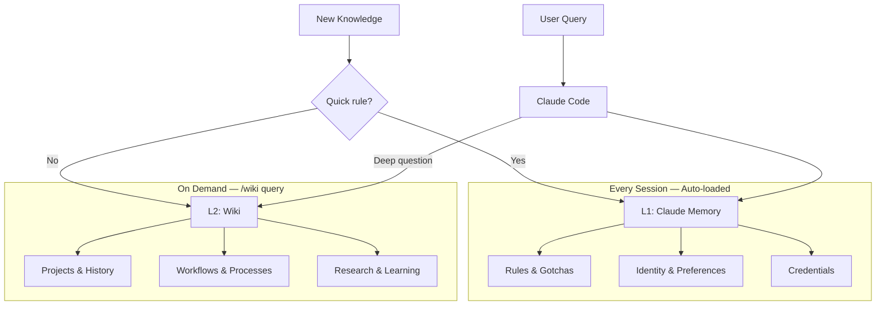
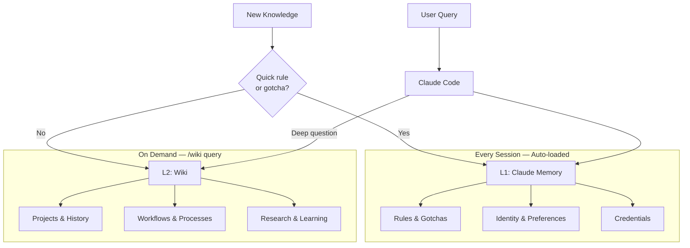
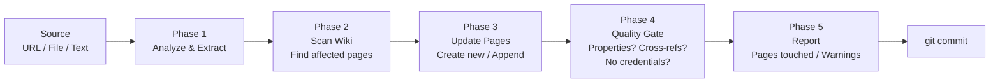

# llm-wiki

[](LICENSE)
[](https://github.com/MehmetGoekce/llm-wiki/releases)
[](https://github.com/MehmetGoekce/llm-wiki/stargazers)
[](https://github.com/MehmetGoekce/llm-wiki)
[](https://github.com/MehmetGoekce/llm-wiki/commits)

Build [Karpathy's LLM Wiki](https://gist.github.com/karpathy/442a6bf555914893e9891c11519de94f) with Claude Code. Two-layer cache architecture (L1/L2). Supports Logseq and Obsidian.



## What is this?


*Your wiki after a few ingests — interconnected knowledge pages in Logseq's graph view.*

In April 2026, Andrej Karpathy published a gist called "LLM Wiki" that got 5,000+ stars in days. The idea: let an LLM maintain a structured, cross-referenced wiki for you. Feed it raw sources, it extracts facts, links them together, and keeps everything consistent. The wiki becomes a persistent, compounding artifact instead of a graveyard of stale notes.

Everyone loved the concept. Almost nobody built one. The gist describes *what* to build, not *how* to wire it up with real tools, real files, and real workflows. **llm-wiki** is the implementation. It uses Claude Code as the LLM brain and either Logseq or Obsidian as the wiki UI, with a two-layer cache architecture that turned out to be the key insight Karpathy's gist does not mention.

## Why use this?

- **5-minute setup.** `./setup.sh` creates your schema, namespaces, and git tracking. No manual design needed.
- **Claude becomes your wiki maintainer.** `/wiki ingest` updates 5-15 pages with cross-references from a single source.
- **L1/L2 architecture.** Auto-loaded rules in memory (L1) + deep knowledge in the wiki (L2). No other tool has this.
- **Built-in quality checks.** `/wiki lint` finds orphan pages, stale content, broken refs, and credential leaks.
- **Logseq + Obsidian.** Use whichever you already have. No tool switch required.

## Quick Start

```bash
git clone https://github.com/MehmetGoekce/llm-wiki.git
cd llm-wiki
./setup.sh
```

`setup.sh` does three things:

- Copies the `/wiki` skill and schema template into your Claude Code project
- Detects your wiki app (Logseq or Obsidian) and configures paths accordingly
- Creates the initial namespace structure with hub pages

Then in Claude Code:

```
/wiki ingest "your first source"
/wiki query "what do I know about X?"
/wiki lint
```

That is it. The wiki starts sparse and gets denser with every ingest.

## The L1/L2 Architecture

This is the part not in Karpathy's gist, and it turned out to be the most important design decision.

When you start building a wiki, the instinct is to put everything in one place. That is wrong. Some knowledge must be available in *every* session, before you even ask a question -- things like "max 2-3 SSH calls to the VPS, never 10+" or "always use ISO 8601 dates." If the LLM has to query the wiki to learn these rules, it has already made the mistake.

Other knowledge only matters in specific contexts. The full history of a project. A detailed API workflow. Loading all of this into every session wastes the context window.

The solution maps to a concept every engineer knows: **CPU cache hierarchy.**

| Layer | What | Size | Loading | Contains |
|-------|------|------|---------|----------|
| **L1** | Claude Code Memory | ~10-20 files | Auto-loaded every session | Rules, gotchas, identity, credentials |
| **L2** | Wiki (Logseq/Obsidian) | ~50-200 pages | On-demand via `/wiki query` | Projects, workflows, research, deep knowledge |



**The routing rule is simple:** Would the LLM making a mistake without this knowledge be dangerous or embarrassing? Then it belongs in L1. Would the mistake be merely inconvenient? Then L2.

Credentials are a special case -- they *must* live in L1 because the wiki is typically git-tracked. The L1 memory directory is excluded from git, making it the only safe place for secrets.

For the full deep-dive, see [docs/l1-l2-architecture.md](docs/l1-l2-architecture.md).

## Commands

| Command | Description |
|---------|-------------|
| `/wiki ingest <source>` | Process a source (URL, file, text), update 5-15 wiki pages |
| `/wiki query <question>` | Search wiki, synthesize answer with source attribution |
| `/wiki lint [--fix]` | Health check: orphans, stale pages, broken refs, credential leaks |
| `/wiki status` | Metrics dashboard: page count, health, recent changes |

### Ingest Flow

Ingest is the core operation. When you run `/wiki ingest "deployed v2.0 to production"`, here is what happens:



**Phase 1 -- Analyze & Extract.** Claude reads the source and extracts entities, facts, relationships, and dates. It classifies each piece by domain (business, technical, content, etc.) and checks whether it belongs in L1 (quick rule) or L2 (deep knowledge).

**Phase 2 -- Scan Wiki.** Claude reads the schema, then scans existing pages to find which ones the new information affects. If you mention a tool that already has an entity page, it knows to update that page too.

**Phase 3 -- Update Pages.** New pages get all required properties from the schema. Existing pages get new content *appended* -- existing content is never overwritten. Target: 5-15 page touches per ingest.

**Phase 4 -- Quality Gate.** Before committing: Do all pages have required properties? Does every page have at least one cross-reference? Are there credential patterns in the content?

**Phase 5 -- Report.** Summary of pages created, updated, cross-references added, and any warnings.

### Query

Query works like a smart search: Claude parses your question, identifies relevant namespaces and entities, reads the top 3-5 matching pages, and synthesizes an answer with source attribution. If the query reveals a gap in the wiki, it offers to create a new page.

### Lint

Lint is the automated health check. It scans every wiki page and checks for: orphan pages (no incoming links), stale content (last updated 90+ days ago but still marked high-confidence), missing required properties, broken references to pages that do not exist, and credential patterns that should not be in a git-tracked file. Run with `--fix` and Claude auto-repairs what it can.

## The Schema

The schema is the contract between you and the LLM. Without it, the LLM creates inconsistent pages -- one uses `status: active`, another `state:: running`, a third has no status field at all. With a schema, every page follows the same structure and automated quality checks become possible.

The schema defines:

- **8 namespaces** (Business, Tech, Content, Projects, People, Learning, Reference, Careers)
- **5 page types** (Entity, Project, Knowledge, Feedback, Hub) with required properties
- **Lint rules** for automated health checks
- **L1/L2 boundary** so the system knows where new knowledge should be routed

For the complete schema reference, see [docs/schema-reference.md](docs/schema-reference.md).

## Logseq vs. Obsidian

Both wiki apps are supported. Choose based on your preference:

| | Logseq | Obsidian |
|---|--------|----------|
| **Properties** | `property:: value` (inline) | YAML frontmatter |
| **Format** | Outliner (`- ` prefix on every line) | Flat markdown |
| **File names** | `Wiki___Tech___Strapi.md` | `Wiki/Tech/Strapi.md` |
| **Links** | `[[Wiki/Tech/Strapi]]` | `[[Wiki/Tech/Strapi]]` |
| **Backlinks** | Automatic (graph-native) | Via plugin or core feature |
| **Block addressing** | Every line is a block | Paragraph-level |
| **License** | AGPL-3.0 (open source) | Proprietary (free for personal use) |

**Logseq** shines when the LLM is doing the writing -- its outliner format means every block is independently addressable, so appending new content never disrupts existing structure.

**Obsidian** is better if you do a lot of manual editing -- flat markdown is more natural to write by hand, and the plugin ecosystem is massive.

For a detailed comparison with migration paths, see [docs/logseq-vs-obsidian.md](docs/logseq-vs-obsidian.md).

## Before & After

The difference between a dead wiki and a living one is page quality.

**Before** -- a placeholder created when the page was first made:

```markdown
- type:: knowledge
- domain:: content
- ## Newsletter
  - To be filled via /wiki ingest.
```

**After** -- synthesized from multiple sources over several ingest operations:

```markdown
- type:: knowledge
- domain:: content
- confidence:: high
- created:: 2026-03-15
- updated:: 2026-04-07
- ## Company Newsletter
  - Monthly newsletter targeting existing clients and prospects.
  - ### Metrics
    - | Metric | Value | As of |
      |--------|-------|-------|
      | Subscribers | ~240 | 2026-04-01 |
      | Open rate | 38% | 2026-04-01 |
      | Cadence | monthly | -- |
  - ### Content Strategy
    - 1 technical deep-dive + 1 business insight per issue
    - Always include a CTA to the latest blog post
    - Subject lines: question format performs 2x better
  - ### Open Questions
    - Segment list by industry vertical?
    - A/B test send time (Tuesday AM vs Thursday AM)?
  - ### Cross-References
    - [[Wiki/Content/Blog]] -- Source content
    - [[Wiki/Content/LinkedIn]] -- Promotion channel
    - [[Wiki/Reference/Workflows]] -- Publishing workflow
```

Every number has a date. Decisions have rationale. Open questions are explicit. Cross-references connect to related pages.

## Configuration

`setup.sh` creates `llm-wiki.yml` in your wiki root. You can also create it manually:

```yaml
# llm-wiki.yml

tool: logseq          # or "obsidian"
wiki_path: ~/Documents/MyWiki/
pages_dir: pages      # relative to wiki_path
memory_path: ~/.claude/projects/my-project/memory/

namespaces:
  - Business
  - Tech
  - Content
  - Projects
  - People
  - Learning
  - Reference
  - Careers

# Lint settings
lint:
  stale_threshold_days: 90
  min_cross_refs: 1
  credential_patterns:
    - "token::"
    - "password::"
    - "secret::"
    - "api.key::"

# Ingest settings
ingest:
  target_page_touches: [5, 15]   # min, max pages per ingest
  append_only: true              # never overwrite existing content

# Language (for multilingual wikis)
language:
  business: en    # Language for business content
  tech: en        # Language for technical content
```

## Trade-offs

No system is perfect. Some things to know:

- **The schema feels overengineered at first.** With 10 pages, defining 5 page types and 8 lint rules seems like overkill. Past 50 pages, you will be grateful for the consistency. Define the schema early -- it is much harder to retrofit one later.
- **Two systems means you need a clear boundary.** Having both L1 and L2 means you could accidentally put the same information in both places. The lint rule for L1/L2 duplicates exists precisely for this reason.
- **Parallel agents can conflict.** If you have multiple Claude sessions writing to wiki files simultaneously, concurrent edits can cause conflicts. Treat wiki files as a shared resource.
- **Start with fewer hub pages.** Let them emerge organically from ingest operations rather than creating empty hubs upfront.

## Documentation

- [FAQ](docs/faq.md) — Common questions before you run `setup.sh`
- [Troubleshooting](docs/troubleshooting.md) — Setup, integration, and runtime issues
- [L1/L2 Architecture](docs/l1-l2-architecture.md) — Why two layers, how to route knowledge
- [Schema Reference](docs/schema-reference.md) — Page types, properties, lint rules
- [Logseq vs. Obsidian](docs/logseq-vs-obsidian.md) — Detailed comparison and migration notes

## Credits

- Inspired by [Andrej Karpathy's LLM Wiki gist](https://gist.github.com/karpathy/442a6bf555914893e9891c11519de94f)
- Built with [Claude Code](https://claude.ai/code)
- Works with [Logseq](https://logseq.com/) and [Obsidian](https://obsidian.md/)

## License

MIT -- see [LICENSE](LICENSE) for details.
